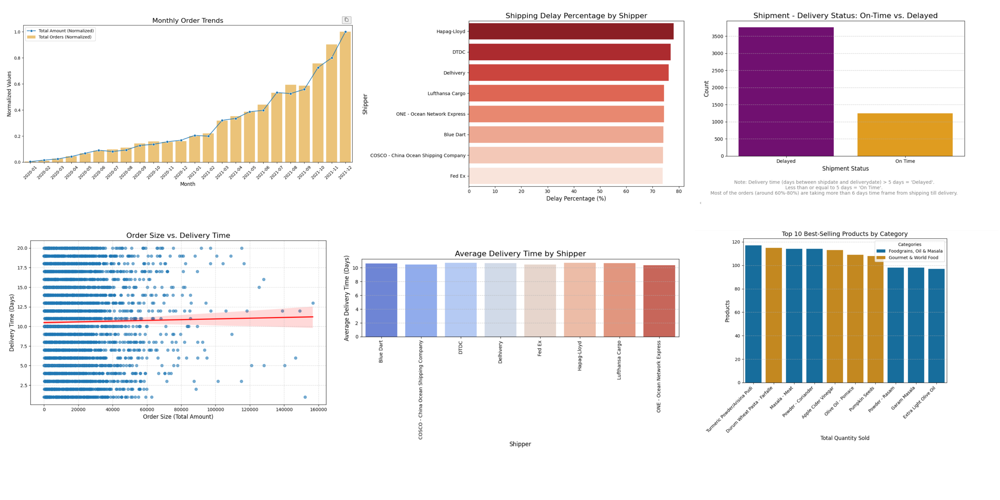
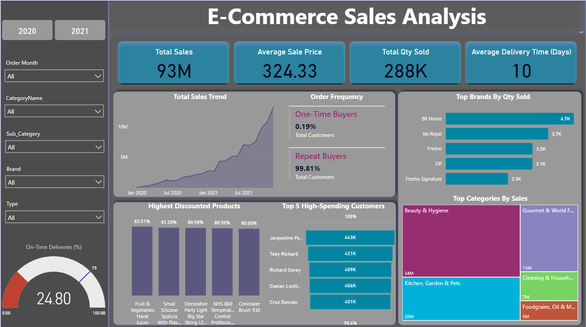

# E-Commerce Analysis

## Overview
This project focuses on analyzing an e-commerce database to uncover key business insights related to sales performance, customer behavior, and shipping efficiency. By leveraging MySQL for data extraction and Python for analysis, the project identifies key insights to optimize and enhance decision-making for e-commerce operations.

## Table of Contents
- [Project Objective](#project-description)
- [Project Approach](#project-description)
- [Tech Stack](#tech-stack)
- [EDA Overview](#eda-overview)
- [Dashboard Overview](#dashboard-overview)

## Project Objective
The objective of this project is to analyze and visualize sales trends, customer retention, and product performance. Evaluate shipping delays and carrier efficiency to provide actionable insights to enhance operational efficiency and boost revenue.

## Project Approach
The project was executed in three key stages:
- ***Data Extraction:*** Queried e-commerce data using MySQL to retrieve and focused on tables like Orders, Customers, Products.
- ***Exploratory Data Analysis (EDA):*** Performed detailed analysis to understand sales performance, order behavior, and shipping delays using Python (matplotlib, seaborn).
- ***Insights Dashboard:*** Created an Sales dashboard using Power BI to visualize our findings comprehensively.

## Tech Stack
- **Database:** MySQL for querying and data extraction.
- **Programming:** Python for data analysis and visualization
- **Libraries:** pandas, matplotlib, seaborn
- **Visualization:** Power BI 

## EDA Overview

The exploratory data analysis (EDA) section provides detailed visualizations to provide a deeper understanding of operational performance and customer behavior. Key visualizations include:

- **Monthly Order Trends:** Line and bar charts showing normalized growth in order count and revenue over time.
- **Shipping Performance:** Bar chart of delay percentages by shipping carriers. Delivery status comparison showing on-time vs. delayed shipments.
- **Order Size vs. Delivery Time:** Scatter plot with regression analysis to explore the relationship between order size and delivery time.
- **Average Delivery Time by Shipper:** Bar chart comparing delivery times across different carriers.
- **Top-Selling Products:** Bar chart of the top 10 best-selling products segmented by category.

## Insights Dashboard Overview

The dashboard presents a detailed analysis of an e-commerce platform's sales performance over two years (2020–2021). The following insights are:

**Key Metrics:**
- Total Sales: 93M
- Average Sale Price: $324.33
- Total Quantity Sold: 288K units
- Average Delivery Time: 10 days

**Performance Analysis:**
- Total Sales Trend: Sales have shown a significant upward trend from January 2020 to end of 2021. This growth suggests a steady increase in customer engagement and product demand.
- Order Frequency: One-Time Buyers (Only 0.19% of total customers), indicating a very high customer retention rate and Repeat Buyers (99.81%), showing strong loyalty and satisfaction among customers.
- Top Brands by Quantity Sold: BB Home leads with 4.7K units sold, followed by bb Royal (3.7K) and Fresho (3.2K). This highlights BB Home’s strong market presence in terms of product popularity.
- Top Categories by Sales: Beauty & Hygiene dominates with 34M in sales followed by Kitchen, Garden & Pets (20M) and Gourmet & World Food (15M), showcasing the diversity of customer preferences.

**Product and Customer Insights:**
- Highest Discounted Products: Products with the highest discounts include "Fruit & Vegetables Hand Juicer" (82.51%) and "Small Silicone Spatula with Plastic Handle" (81.20%). Discounts likely contributed to increased sales volume for these items.
- Top 5 High-Spending Customers: Jacqueline F. ranks highest, with purchases totaling 443K, followed by Toby Richard (421K). These customers contribute significantly to overall revenue.

**Operational Insights:**
- On-Time Deliveries: Only 24.80% of deliveries are on time, indicating a major area for operational improvement. Delivery Time has an average delivery time of 10 days might be impacting customer experience.

---

For any questions or feedback, please feel free to open an issue or contact the project maintainer.

Happy analyzing!

---